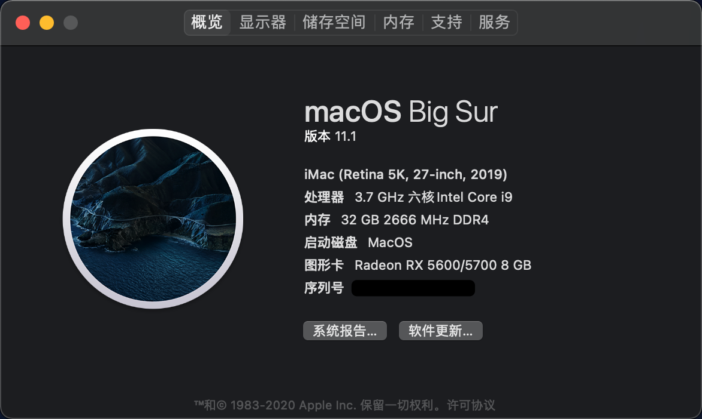

# Hackintosh-ROG-B360i-EFI
Hackintosh, ROG-B360i, i5-9600K, Radeon RX 5700, EFI

### 基本配置

| 硬   件 | 型   号                                                   |
| :------ | --------------------------------------------------------- |
| 主   板 | ROG STRIX B360-I GAMING                                   |
| CPU     | Intel i5-9600K                                            |
| 内   存 | KLEVV 16GB 2666 MHz DDR4  x 2                             |
| 硬盘 1  | WD SN750-500G NVMe「Win 10」                              |
| 硬盘 2  | WD SN750-250G NVMe「MacOS」                               |
| 硬盘 3  | TOSHIBA P300 3T「数据」                                   |
| 网   卡 | Broadcom BCM94360CS2 NGFF「主板拆下原装网卡，更换该网卡」 |
| 电   源 | Corsair SF600 PLATINUM                                    |
| 显卡 1  | AMD Radeon RX 5700 8G                                     |
| 显卡 2  | Intel UHD Graphics 630                                    |
| 机   箱 | SGPC K77                                                  |
| 散   热 | Thermalright AK120 mini                                   |
| 显示器  | LG 27UL550 -W 4K                                          |

### 参考链接：

1. [OpenCore黑苹果引导配置说明第十二版PDF版.pdf](./OpenCore黑苹果引导配置说明第十二版PDF版.pdf)
2. [使用 OpenCore 引导黑苹果 -- xjn819's blog](https://blog.xjn819.com/post/opencore-guide.html)
3. [RTC综述 -- xjn819's blog](https://blog.xjn819.com/post/rtc-issues-related-to-oc.html)
4. [jiangwweie/ROG-B360I-EFI](https://github.com/jiangwweie/ROG-B360I-EFI)
5. [黑苹果（Hackintosh）Intel & AMD 全面新手引导（配置+安装）](http://bbs.pcbeta.com/viewthread-1874306-1-1.html)
6. [【Len's DMG】macOS Big Sur 11.1 20C69 Clover 5128 and OC 0.6.6三引导镜像](http://bbs.pcbeta.com/viewthread-1880542-1-1.html)
7. [完美黑苹果定义-供大家参考-oc引导rogb360i+hp580+9100f](http://bbs.pcbeta.com/viewthread-1879378-1-1.html)

### 需要补充的地方：（⌛️待更新）

1. 如果是Win系统，应该怎么安装？
2. 如果配置和我不同，需要在哪里做修改？
3. 我是如何参加文章/教程/别人的EFI，一步步排错的？
   - 主板的设置（按照图片顺序）
     - 主板开启核显
   - 利用 OpenCore Configurator 修改 config.plist：
     1. 核心显卡，独立显卡的相关信息
     2. 三码注入
     3. 解决开机F1问题：SSDT注入
4. 要讲清楚的地方：
   1. 下载最新版本安装包/OC
      - 千万要验证 MD5
   2. 利用 balenaEtcher 烧录
   3. 安装时需要如何分区
   4. 测试内容（核显、独显、声卡、Wi-Fi、蓝牙、接力、随航、隔空、GPU加速、睡眠 ... ）
   5. 挂载分区、替换 EFI

